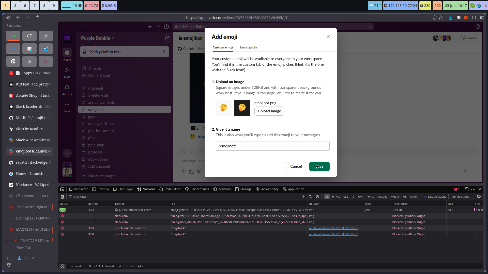
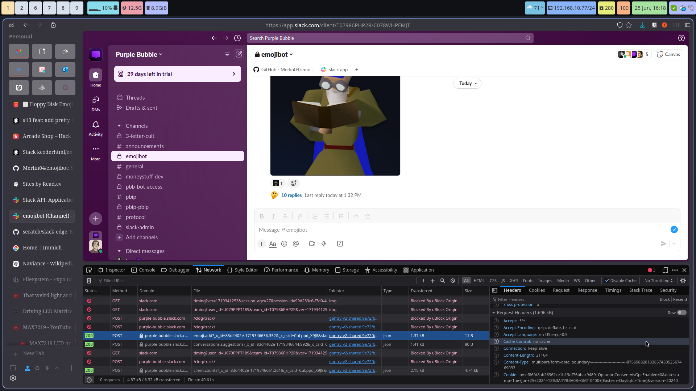
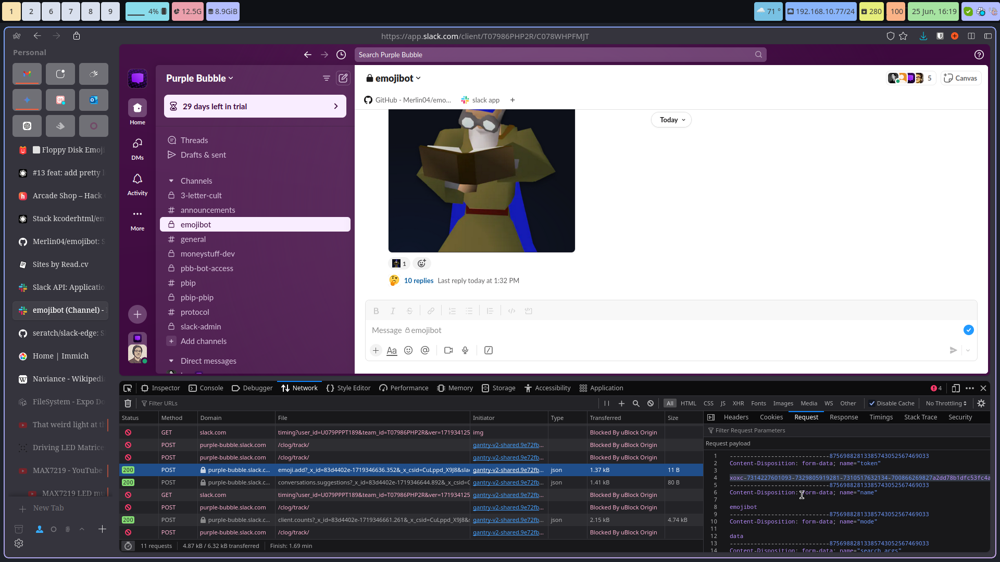

# Emojibot

- [Emojibot](#emojibot)
  - [Usage](#usage)
    - [Environment variables:](#environment-variables)
      - [Getting the slack user token and cookie](#getting-the-slack-user-token-and-cookie)
    - [Slack App Manifest:](#slack-app-manifest)
    - [Running the bot](#running-the-bot)
  - [License](#license)
  - [Author](#author)

Simple slack bot to add emoji to your workspace when a user posts a message in a channel with an image and emoji name.

## Usage
### Environment variables:
```env
SLACK_SIGNING_SECRET=your_slack_signing_secret
SLACK_BOT_TOKEN=your_slack_bot_token
SLACK_APP_TOKEN=your_slack_app_token

SLACK_BOT_USER_TOKEN=your_slack_bot_user_token # follow the instructions below to get this token
SLACK_COOKIE="b=..." # get this from the browser following the instructions below

SLACK_WORKSPACE=yourworkspace # e.g. "myworkspace" for myworkspace.slack.com
SLACK_CHANNEL=your-channelid
ADMINS=admin1,admin2 # comma separated list of slack user ids; workspace admins are automatically added
```
#### Getting the slack user token and cookie
1. Open the slack workspace in a browser
2. Open the developer tools (F12)
3. Go to the network tab
4. Add an emoji

5. Look for the request to `emoji.add` and copy the `cookie` header from the Headers tab

6. Copy the `token` value from the `emoji.add` request in the Request tab



### Slack App Manifest:
```yaml
display_information:
  name: Emojibot
  description: "Upload emojis in #emojibot"
  background_color: "#b35300"
features:
  bot_user:
    display_name: Emojibot
    always_online: false
  shortcuts:
    - name: Delete emoji
      type: message
      callback_id: delete_emoji
      description: Delete an emoji created with Emojibot
    - name: Retry emoji
      type: message
      callback_id: retry_emoji
      description: try to upload the emoji again
oauth_config:
  scopes:
    bot:
      - channels:history
      - chat:write
      - commands
      - files:read
      - groups:history
      - reactions:write
      - users:read
settings:
  event_subscriptions:
    request_url: https://yoururlhere.com
    bot_events:
      - message.channels
      - message.groups
  interactivity:
    is_enabled: true
    request_url: https://yoururlhere.com
  org_deploy_enabled: false
  socket_mode_enabled: false
  token_rotation_enabled: false
```

### Running the bot

there are two ways to run the bot:
a) through bun by running `bun run src/index.ts` and having a `.env` file in the root directory with the environment variables above or
b) through docker with the prebuilt image kcoderhtml/emojibot:latest and the environment variables above in a docker-compose.yaml as shown [here](docker-compose.yaml)

## License
MIT

## Author
Thanks to @merlin04 for the original code and the idea you can find their code at [Merlin04/emojibot](https://github.com/Merlin04/emojibot)